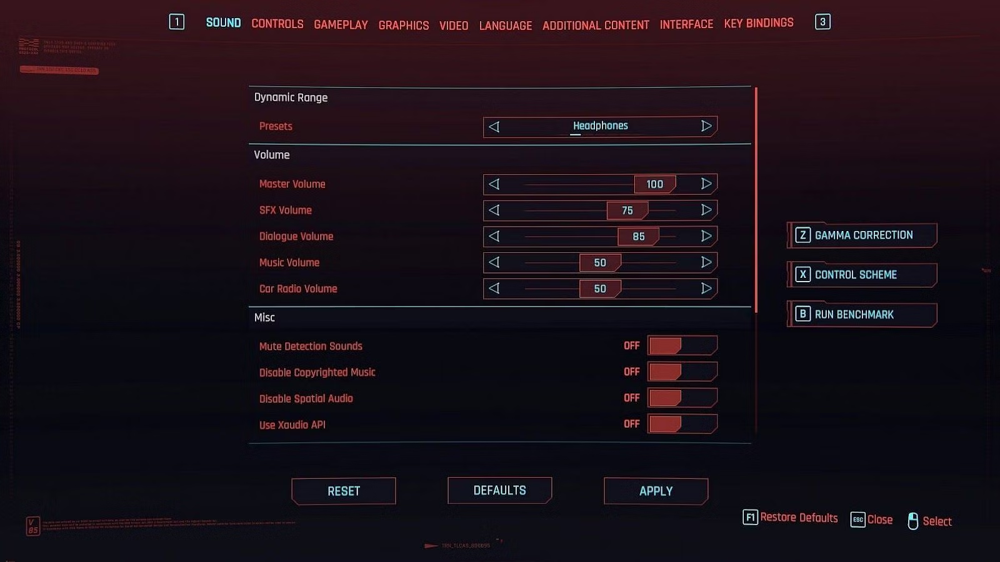

# Routing

Each section in the manifest will be routed to different tracks internally.

This is important because each track will come with different behavior.

## Volume settings

Depending on which section audio is defined, it will be affected by a specific game volume setting.

```admonish gear title="Cyberpunk volume settings"


| track  | volume           
|--------|----------------
| sfx    | SfxVolume      
| onos   | DialogueVolume 
| voices | DialogueVolume 
| music  | MusicVolume    

All audio are always affected by `MasterVolume`, as expected.
```

```admonish youtube title="YouTube demo"
<iframe width="100%" height="420" src="https://www.youtube.com/embed/eE5jRxl8HAY?si=KBzA9kfuWZMKwx-r" title="YouTube video player" frameborder="0" allow="accelerometer; autoplay; clipboard-write; encrypted-media; gyroscope; picture-in-picture; web-share" referrerpolicy="strict-origin-when-cross-origin" allowfullscreen></iframe>
```

## Parameters

Likewise each track will be affected, or not, by [preset](./PARAMETERS.md#preset) and [reverb mix](./PARAMETERS.md#reverb-mix).

| track  | preset | reverb |
|--------|--------|--------|
| sfx    | ✅     | ✅      |
| onos   | ✅     | ✅      |
| voices | ✅     | ✅      |
| music  | ❌     | ❌      |

## Going further

This might sounds restrictive at first, but it's actually a way to provide good defaults while being easily worked-around when needed.

```admonish hint title="Tip"
Imagine you want to play a song affected by [underwater preset](./PARAMETERS.md#preset) when V dives underwater.

Even if you'd usually go for [music](./SECTIONS.md#music) section,  
nothing prevents from defining your audio in [sfx](./SECTIONS.md#sfx) instead with *streaming* [usage](./SETTINGS.md#usage) for example.
```
