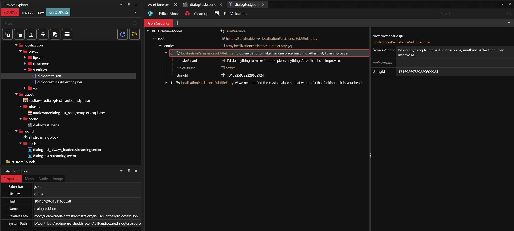
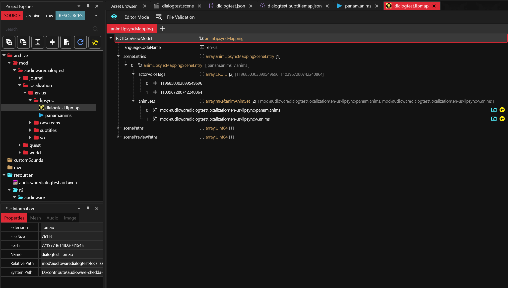
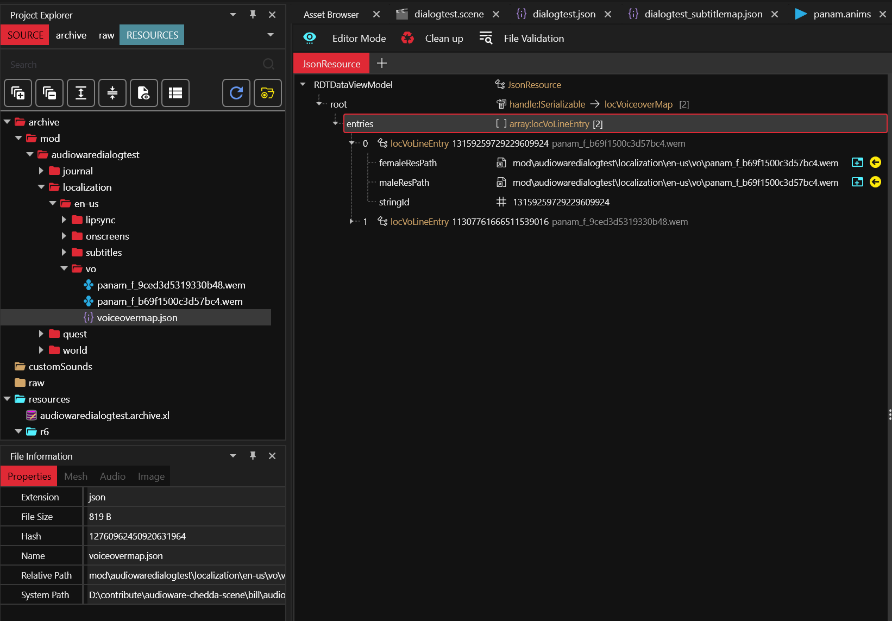
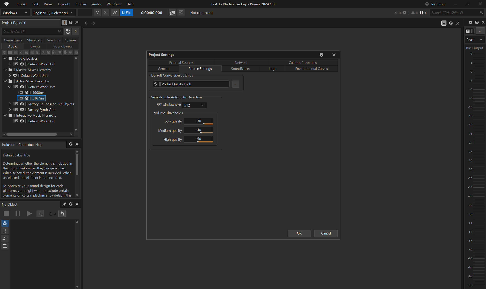
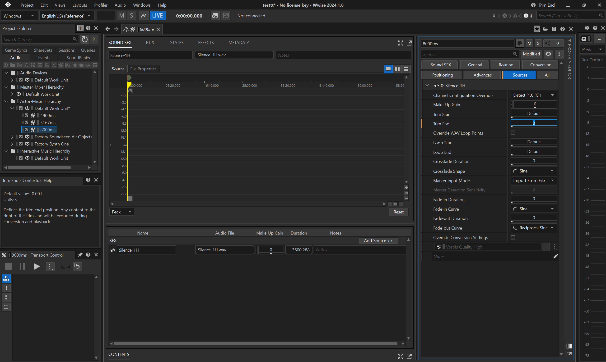
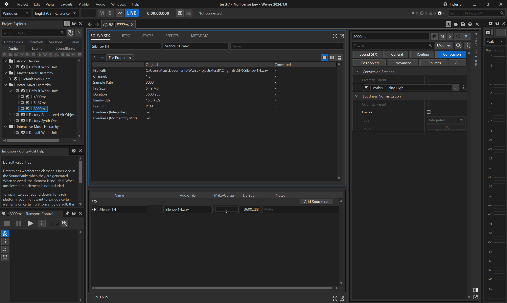
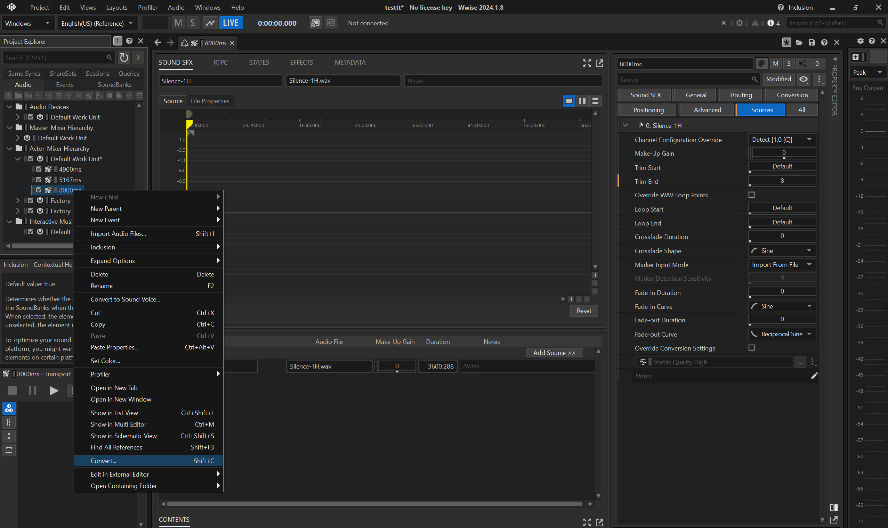

# Scene dialog lines

Audioware allows to use custom audio in Quest Scenes dialog lines, which can be freely mixed with vanilla ones.

## Preambule

A scene a.k.a [scnSceneResource][scnSceneResource] contains multiple nodes a.k.a [scnSectionNode][scnSectionNode] chained together to create a dialogue between V and NPCs and other interactions.

Thanks to WolvenKit Editor you can already visualize Quests, including their Phases and Scenes.

Multiple scene section nodes can contain a dialog line event a.k.a [scnDialogLineEvent][scnDialogLineEvent].


But a single scene section node can also contains multiple successive dialog line events.


This concept applies for discussions over the holocall, during braindances, yet using different scene nodes that won't be covered here.

## Creating a dialogue

This documentation won't go over the basics of `.quest`, `.questphase` and `.scene` as [REDmodding Wiki already does](https://wiki.redmodding.org/cyberpunk-2077-modding/modding-guides/quest).

Aside from nodes, a dialog line itself requires roughly 4 components:

1. a voice actor
1. audio asset(s) for the voice
1. subtitle(s) to display on-screen
1. lipsync animation(s) to be performed by the actor

```admonish info
Implementing the first 3 ones is relatively easy while lipsync requires additional consideration, as developed below.
```

Consider first that, for most of the dialog lines in the game, you probably don't need any lipsync.

```admonish tip
If you think about it one second, most of V's dialogues are made in first-person perspective (fpp).

So unless V stands nearby a reflecting surface, a mirror, or sits inside a car (where third-person perspective or tpp, can be activated) you probably don't need to worry about lipsync.

For a large portion of NPCs it's gonna be the same: devices, drones, droids, cyborgs and mechs do not have lips.

Scavs with digital masks, humanoids with clothing or cyberware covering their lips also fall into this category.
```

Since the topic is hairy, a [sample example .scene is provided in the repo](https://github.com/cyb3rpsych0s1s/audioware/tree/main/examples/scenes),
on which the following documentation is directly based so that you can follow along,
a courtesy of [MrBill][MrBill].

## Actor

In order to voice a dialogue you must first define the actors.

At a minimum, there's a `speaker` (the one who talks), and an `addressee` (the one being talked to).

The [actors][actors] field in the [scnSceneResource][scnSceneResource] defines all the actor(s), except for the player's actor(s).


The player's actor(s) can be found under [playerActors][playerActors].


## Voice

For example, here's how adding a custom dialog line audio for Panam in Audioware looks like:

```yml
# resources\r6\audioware\dialogtest\dialogs.yaml
version: 1.0.0
dialogs:
  13159259729229609924:
    en-us: ./en-us/vo/panam_f_b69f1500c3d57bc4.Mp3
```

In this snippet the RUID `13159259729229609924` is actually the hash of the hexadecimal `b69f1500c3d57bc4`. It is used to establish a relationship between resources. This is how the RED engine knows which subtitle to pick for a given voice, which lipsync anim to play, etc.

```admonish tip
In the RED engine, the same naming convention is usually observed for audio assets:

`{actor}_{f,m,i}_{hex}.wem` e.g. `panam_f_b69f1500c3d57bc4.wem`

> where `f` stands for `female`, `m` for `male` and `i` when the notion of gender is irrelevant.
```

The file path at the bottom indicates to Audioware where to load the audio asset from for a specific language, here `en-us`:


## Subtitle

Audioware does not handle the subtitles for this feature, because RED engine already perfectly does.

### subtitles entries

First, add subtitle entries:



Here you can notice the `stringId` `13159259729229609924` is the same as the one defined for the [Voice](#voice).

Each entry is an (optionally genderized) subtitle for a given localization string ID (a.k.a `locStringId` or simply `stringId`).

### subtitles map

Then map the subtitles:


It links the actual subtitles file to a subtitles group.

### subtitles localization

Finally, don't forget to register the subtitles map in the `.xl` manifest:

```yml
# resources\audiowaredialogtest.archive.xl
localization:
  subtitles:
    en-us: mod\audiowaredialogtest\localization\en-us\subtitles\dialogtest_subtitlemap.json
```

It links to the map for a given language.

## Lipsync

At the time of writing, creating custom lipsync animation is not possible yet.

That being said, you can apply the trick that the movie industry has been using for over 50 years already when dubbing movies in foreign languages: find a lipsync animation that roughly matches both the duration and flow of the speech, and uses it.

It's not perfect, but when carefully picked it usually does the trick.

```admonish tip
You will usually be tempted to create a custom audio for your sentence first, then search for the [corresponding lipsync animations in SoundDB](https://sounddb.redmodding.org/subtitles).

Although it might seem counter-intuitive at first, the reverse workflow generally yields a better outcome: find some interesting sentence which roughly match what you want your character to say, and then generate the closest possible sentence to match the lipsync!
```

### lipsync animation

First define the `.anims`:


It contains raw lipsync animation and the rig for the 3D model.

### lipsync map

Then, define the `.lipmap`:



It links the actors by their voice tag to the lipsync animation and subtitles for a given language.

### lipsync map localization

Don't forget to register the `.lipmap` in the `.xl` manifest:

```yml
# resources\audiowaredialogtest.archive.xl
localization:
  # ...
  lipmaps:
    en-us: mod\audiowaredialogtest\localization\en-us\lipsync\dialogtest.lipmap
```

### voiceover map

By default the RED engine won't play lipsync at all if there's no associated `.wem`(s).

This is what you can define here:



It links the localization string ID to the audio asset for each gender.

### silent .wem

Another peculiarity of the RED engine is that it will start playing a lipsync anim as long as a `.wem` exits, but if its duration does not match with lipsync anim it will abruptly stop playing it before reaching its end.

This is why, at the time of writing, creating silent `.wem` with matching duration is a necessary evil.

The most common way to do it is with Wwise.

#### install Wwise

Go to their [download section](https://www.audiokinetic.com/en/download/), you will also need to create an account.

#### create new project

You need to create a project to handle the conversion between `.wav` to `.wem`.

You can use the default suggested settings, but don't forget to specify the `Conversion Settings` to `Vorbis Quality High`.



#### convert silent audio

Let's imagine you need a 8s long silent `.wem` as a placeholder for your lipsync anim.

1. create an empty `Sound SFX Container` under the `Default Work Unit` in `Actor-Mixer Hierarchy`.
   
1. rename the container to e.g. `8000ms`
1. import a silent `.wav`: for convenience you can find a [1h-long .wav in the repo](https://github.com/cyb3rpsych0s1s/audioware/blob/main/silence1h.wav), a courtesy of [DBK][DBK], that you can simply trim to the appropriate duration.
   
1. don't forget to use `Sound SFX`
   
1. if you need to do multiple silent `.wem` of different durations, it is fine to reuse the same asset.
   
1. then trim the audio, e.g. to `8` seconds.
   
1. before converting, make sure the `Conversion Settings` for the container is set to `Vorbis Quality High`
   
1. convert the trimmed `.wav` to `.wem`
   
1. copy the converted `.wem` from Wwise cache (`.cache` folder by default). Each asset is identified by its hexadecimal, so it's important to select the appropriate one, usually the latest.
   
1. finally paste it in your WolvenKit `archive`.

### voiceover map localization

Don't forget to register the `.json` in the `.xl` manifest:

```yml
# resources\audiowaredialogtest.archive.xl
localization:
  # ...
  vomaps:
    en-us: mod\audiowaredialogtest\localization\en-us\vo\voiceovermap.json
```

### string id variants map

Last but not least, there's an additional file which contains the duration (or length) of the string IDs.
If you browse vanilla files, you can find it under e.g. `base\localization\en-us\stringidvariantlengthsreport.json`.

At the time of writing ArchiveXL does not support creating custom ones just yet,
so here's how you can do with Codeware instead:

```swift
class ATStringidVariantLengthsReportService extends ScriptableService {
  private cb func OnLoad() {
    GameInstance
      .GetCallbackSystem()
      .RegisterCallback(n"Resource/PostLoad", this, n"OnPostLoad")
      .AddTarget(
        ResourceTarget.Path(r"base\\localization\\en-us\\stringidvariantlengthsreport.json")
      );
  }

  private cb func OnPostLoad(event: ref<ResourceEvent>) {
    let resource: ref<JsonResource> = event.GetResource() as JsonResource;
    let map: ref<locVoiceoverLengthMap> = resource.root as locVoiceoverLengthMap;

    let panamline1: locVoLengthEntry;
    panamline1.stringId = HashToCRUID(13159259729229609924ul);
    panamline1.femaleLength = 4.9;
    panamline1.maleLength = 4.9;

    ArrayPush(map.entries, panamline1);
  }
}
```

## Showcase

And here's the result, thanks to [MrBill][MrBill] for the `.scene` comparing:
| sentence | audio           | lipsync |
|----------|-----------------|---------|
| vanilla  | vanilla wem     | vanilla |
| vanilla  | audioware mp3   | vanilla |
| modded   | audioware mp3   | vanilla |

```admonish youtube title="YouTube demo"
<iframe width="100%" height="420" src="https://youtu.be/8ZxQGmgXOUQ" title="YouTube video player" frameborder="0" allow="accelerometer; autoplay; clipboard-write; encrypted-media; gyroscope; picture-in-picture; web-share" referrerpolicy="strict-origin-when-cross-origin" allowfullscreen></iframe>
```

## Overview

Ok, this was a mouthful!

Here's a quick schema summarizing the resources and their dependencies.


Big tokens of appreciation to [MisterChedda][MisterChedda], [MrBill][MrBill], [DBK][DBK] and [Dedra][Dedra] without whom this feature would probably have never been finished!

[scnSceneResource]: https://nativedb.red4ext.com/scnSceneResource
[actors]: https://nativedb.red4ext.com/scnSceneResource#actors
[playerActors]: https://nativedb.red4ext.com/scnSceneResource#playerActors
[scnSectionNode]: https://nativedb.red4ext.com/scnSectionNode
[scnDialogLineEvent]: https://nativedb.red4ext.com/scnDialogLineEvent
[MrBill]: https://github.com/MrBilL61
[MisterChedda]: https://next.nexusmods.com/profile/MisterChedda
[DBK]: https://next.nexusmods.com/profile/DBK01
[Dedra]: https://next.nexusmods.com/profile/dederara
